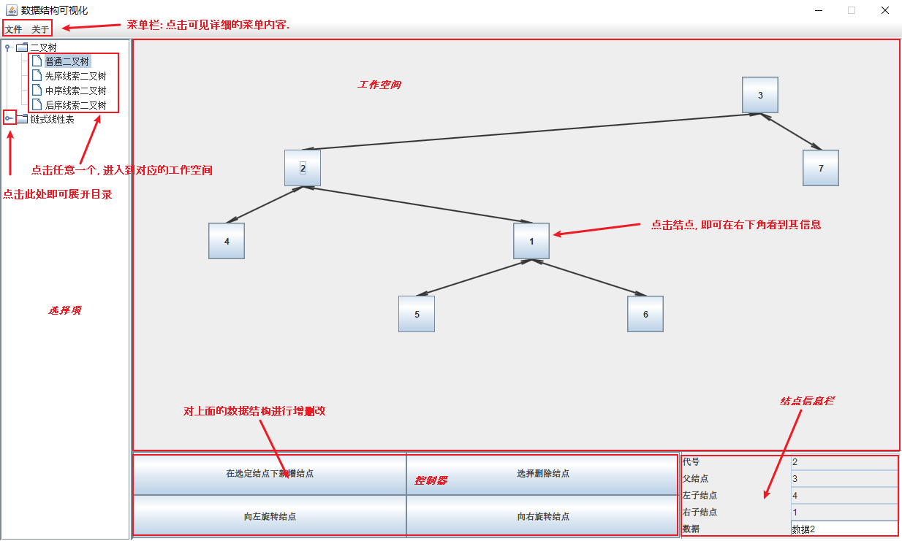

# 可视化数据结构 软件文档

---

[TOC]

---

## 可行性研究报告

### 开发目标

旨在开发一个用于演示数据结构的轻量级软件, 用于演示基本数据结构及其增删改查的变化, 最终开发出一个教学演示用途的实用性软件.

### 可行性分析

1. 本软件采用**JAVA**编程语言进行开发. **JAVA**提供了简单的标准图形包**AWT**与**Swing**, 因此可视化演示可行.
2. 本软件采用**JAVA**编程语言进行开发. **JAVA**是支持面向对象范式的编程语言, 因此可以对数据结构进行抽象归类, 尽可能提高代码复用率并降低工程复杂度, 因此该工程可行.

---

## 项目开发计划

### 开发人员

@**19373372 叶焯仁** : 北京航空航天大学计算机学院2019级本科生.

### 开发环境

* JDK版本 : **13.0.1**
* IDE软件 : **Jetbrains IntelliJ IDEA Community Edition 2020.2.1**

### 开发进度

* 开发时间 : 2020.9.1 - 2020.11.28
* 开发记录 : [Github-link](https://github.com/Coekjan/VisibleDataStructure)
* 总代码行 : 2297 (除去GUI框架, 约2000行)

---

## 软件需求说明书

### 功能简述

1. 提供简易的用户界面, 大小固定为`1250 * 750`像素.
   * 用户界面分为左右两侧, 左侧用于选择演示何种数据结构, 右侧用于绘图控制.
   * 右侧分为上下两部分, 上部用于展示数据结构, 下部分用于展示控制按钮与所选结点信息.
   * 下部分为左右两块, 左块用于排放控制按钮, 右块用于展示目前所选的结点信息.
2. 提供两种基本数据结构的教学演示, 包括链表与二叉树. 均提供完备的*增删改*功能. 具体的*增删改*功能如下:
   * 链表提供增加与删减结点, 修改结点数据三大功能.
   * 二叉树提供增加与删减结点, 修改结点数据, 旋转结点三大功能.
3. 关于修改结点数据, 首先点击所需要修改的结点, 随后在右下角直接修改其数据.
4. 提供语言切换功能, 支持中英双语.

### 性能要求

1. 必要时限制用户的操作, 避免演示图形溢出显示区域.
2. 要求能够同时进行缓存多个数据结构的演示图, 以方便来回切换查看.

---

## 测试计划

对软件进行如下的顺序测试:

1. 对所有对话框的按钮逻辑进行测试: 点击确认, 取消, 直接强制关闭对话框. 考察此三种方法是否引发程序不可预测或异常行为.
2. 分别对每种数据结构进行结点的增删测试, 主要体现随机性增删.
3. 联合所有数据结构进行结点的增删改测试, 随时切换数据结构看数据是否丢失, 以及是否引发异常, 主要体现统筹性测试.
4. 发布内测版本, 邀请数为未参与开发的人员进行测试, 接受漏洞反馈并予以修正.

---

## 软件设计说明

本软件使用面向对象范式进行编程, 主要分为两个包, 下面分别介绍:

### Visibility

此包提供如下类, 抽象类与接口:

#### GUIFramework (class)

提供生成用户界面的唯一通道, 即实例化`GUIFramework`, 其中此实例化必须提供两个参数, 用于指示需要生成的数据结构及其控制类.

#### GUILangSupporter (class)

提供双语界面的静态成员. 采用`LangString`以实现双语结构与切换.

#### LangString (class)

提供双语类, 应用于`GUILangSupporter`中. 并提供`toString`方法, 用于获取当前语言下的字符串.

#### DrawablePane (abstract class)

提供所有数据结构演示面板的抽象父类, 应用于`CanvasPairController`的实现中.

#### CanvasPairController (abstract class)

提供所有数据结构演示面板控制器的抽象父类, 有且仅有此类的非抽象子类可用于`GUIFramwork`的实例化.

#### ButtonPairShapeConstructor (interface)

提供所有结点的按钮形状控制器的接口, 有且仅有此类的子类能添加到`DrawablePane`的内部并借其展示.

#### CanvasPairControllerConstructor (interface)

提供演示控制面板`CanvasPairController`的生成接口, 用于`Main`函数中的引用并加载到`GUIFramwork`中.

### VisibleStructure

此包提供如下类, 抽象类与接口:

#### ArrowLine

提供箭头的绘制手段, 实例化时传入起点与终点以及方向, 调用其`getShapeArray`方法即可得到所有须绘制的`Shape`.

#### StructureNodeController

此抽象类的内部抽象类`StructureNodeButtonPairShape`实现了`ButtonPairShapeConstructor`, 并声明了一系列结点有关的属性与方法. 是后面所有结点的公共父类.

#### GenenalLinkedListController

此抽象类继承了`CanvasPairController`, 声明了一系列有关链表的属性与方法, 为后续**链表**数据结构的公共父类.

#### GeneralLinkedNodeController

此抽象类继承了`StructureNodeController`, 声明了一系列有关链表结点的属性与方法, 为后续的**链表结点**的公共父类.

#### GeneralBinaryTreeController

此抽象类继承了`CanvasPairController`, 声明了一系列有关二叉树的属性与方法, 为后续的**二叉树**数据结构的公共父类.

#### GeneralBinaryTreeNodeController

此抽象类继承了`StructureNodeController`, 声明了一系列有关二叉结点的属性与方法, 为后续的**二叉结点**的公共父类.

#### SinglyLinkedListController

此类继承于`GenenalLinkedListController`, 内部类`SinglyLinkedNodeController`继承于`GeneralLinkedNodeController`. 实现了单向不循环链表的绘制与控制, 可用于实例化.

#### DoublyLinkedListController

此类继承于`GenenalLinkedListController`, 内部类`DoublyLinkedNodeController`继承于`GeneralLinkedNodeController`. 实现了双向不循环链表的绘制与控制, 可用于实例化.

#### CommonBinaryTreeController

此类继承于`GeneralBinaryTreeController`, 内部类`CommonBinaryTreeNodeController`继承于`GeneralBinaryTreeNodeController`. 实现了一般的二叉树绘制与控制, 可用于实例化.

#### TraversalBinaryTreeController

此抽象类继承了`CommonBinaryTreeController`, 内部类`TraversalBinaryTreeNodeController`继承于`GeneralBinaryTreeNodeController`, 将用于实现各类遍历的图形绘制控制. 详见以下三种具体实现.

#### NLRBinaryTreeController

此类继承于`TraversalBinaryTreeController`, 实现了先序遍历的绘制手段, 可用于实例化.

#### LNRBinaryTreeController

此类继承于`TraversalBinaryTreeController`, 实现了中序遍历的绘制手段, 可用于实例化.

#### LRNBinaryTreeController

此类继承于`TraversalBinaryTreeController`, 实现了后序遍历的绘制手段, 可用于实例化.

---

## 使用说明

保证配置好Java环境后, 双击**JAR**包即可运行该程序. 界面解析如下:

* 菜单栏说明
  * 文件
    * 新建 - 新建窗口
    * 语言 - 切换语言
    * 退出 - 退出程序
  * 关于
    * 资助 - 资助作者
    * 作者 - 开发者信息
    * 反馈 - 反馈与建议
* 选择项说明
  * 二叉树
    * 普通二叉树 - 提供二叉树的普通演示
    * 先序线索二叉树 - 提供二叉树的先序遍历演示(隐藏父子结点链接)
    * 中序线索二叉树 - 提供二叉树的中序遍历演示(隐藏父子结点链接)
    * 后序线索二叉树 - 提供二叉树的后序遍历演示(隐藏父子结点链接)
  * 链式线性表
    * 单向不循环链表 - 提供单向不循环链表的演示
    * 双向不循环链表 - 提供双向不循环链表的演示

**部分越界行为说明**:
1. 当结点数目过多时, 将不能再添加结点
2. 当结点数目过少时, 将不能再删除结点
3. 当二叉树的高度达到限制时, 某些旋转操作将被禁止.

---

## 项目开发总结

本软件为开发者@**19373372 叶焯仁** 的面向对象程序的设计初探. 在软件开发之初, 由于对**JAVA**的不熟悉以及**面向对象**编程范式的不熟练, 为了提高代码复用率以及程序的可扩展性, 开发者对本软件进行了多次重构, 最终形成了如今的框架结构. 开发以来, 成就感十足.

但也由于专业课课业繁重, 以及课程时间的限制, 本软件并未做得尽善尽美, 精妙绝伦, 也是一个小遗憾. 此外开发者提出以下的反思与愿景:

1. 关于增量开发: 由于本软件采用了较好的代码架构, 因此扩展性增量开发不是问题.
2. 关于文件转储: 此功能将在可预见的未来上线. 上线后, 将极大提高演示方便性以及远程传输的便捷度.
3. 关于用户界面: 本软件采用的界面为原生的**Swing**, 并不十分美观. 后续将改换为其他GUI架构进行维护.